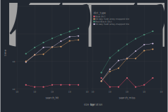
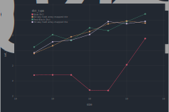

````julia
using PureFun, PureFun.Tries, PureFun.HashMaps,
      BenchmarkTools, Gadfly, DataFrames, Query, Printf,
      Random, Statistics

const w, h = 900px, 600px
set_default_plot_size(w, h)

nstrings(n) = collect(randstring(rand(8:15)) for _ in 1:n)
randpairs(n) = (k => v for (k,v) in zip(nstrings(n), rand(Int, n)));
````

# Setup

We compare a handful of dictionary implementations to `Base.Dict` for lookup
and insert. Specifically, we have the red-black dictionary and both the 32 and
64-way branching hash array mapped tries.

````julia
@trie(BitMapTrie32,
      edgemap = PureFun.Contiguous.bitmap(32),
      keyfunc = PureFun.Contiguous.biterate(5))

@trie(BitMapTrie64,
      edgemap = PureFun.Contiguous.bitmap(64),
      keyfunc = PureFun.Contiguous.biterate(6))

@hashmap(HAMT32,
         approx = BitMapTrie32,
         exact  = PureFun.Association.List)

@hashmap(HAMT64,
         approx = BitMapTrie64,
         exact  = PureFun.Association.List)

dictionaries = Dict(
    PureFun.RedBlack.RBDict => "Red-Black Dict",
    HAMT32 => "32-way hash array-mapped trie",
    HAMT64 => "64-way hash array-mapped trie",
    Base.Dict => "Base.Dict");
````

# Lookups

````julia
function bench_lookup(DT, sizes = 10 .^ (1:7))
    DictType, label = DT
    search_hit = Vector{Int}(undef, length(sizes))
    search_miss = Vector{Int}(undef, length(sizes))
    for ix in eachindex(sizes)
        kvs = randpairs(sizes[ix])
        d = DictType(kvs)
        ks = collect(kv.first for kv in kvs)

        hit  = @benchmark $d[k] setup=k=rand($ks)
        miss = @benchmark get($d, k, -1) setup=k=randstring(rand(8:15))

        search_hit[ix]  = round(Int, median(hit).time)
        search_miss[ix] = round(Int, median(miss).time)
    end
    DataFrame(dict_type   = label,
              size        = sizes,
              search_hit  = search_hit,
              search_miss = search_miss)
end

lookup_results = mapreduce(bench_lookup, vcat, dictionaries)

Gadfly.with_theme(:dark) do
    plot(stack(lookup_results, [:search_hit, :search_miss]) |>
             @rename(:variable => :operation, :value => :time) |>
             DataFrame,
     x = :size, y = :time, color = :dict_type, xgroup = :operation,
     Geom.subplot_grid(Geom.point, Geom.line),
     Scale.x_log10, Scale.y_log10,
     Guide.colorkey(pos = [.5w, -.3h]))
end
````


For the largest containers tested, the hash array mapped tries remain within
range of `Base.Dict`:

````julia
lookup_results |>
    @filter(_.size == 1e7) |>
    DataFrame |>
    x -> sort(x, [:search_miss])
````

````
4×4 DataFrame
 Row │ dict_type                      size      search_hit  search_miss
     │ String                         Int64     Int64       Int64
─────┼──────────────────────────────────────────────────────────────────
   1 │ Base.Dict                      10000000          12           16
   2 │ 64-way hash array-mapped trie  10000000          78           53
   3 │ 32-way hash array-mapped trie  10000000          92           67
   4 │ Red-Black Dict                 10000000         126          112
````

# Insertion

For these comparisons, we are using the immutable `setindex` for the PureFun
dictionaries, but comparing it to the mutable `setindex!` of `Base.Dict`. So
we're kind of looking at the extra cost on insertions for immutability. To make
the benchmarks easier to write, for the purposes of this script define
`setindex` on `Base.Dict` as a mutating method (don't do this in general!):

````julia
function PureFun.setindex(d::Dict, v, k)
    d[k] = v
    return d
end;
````

Now we can define appropriate benchmarking functions based on whether the
method being tested has side effects. In preliminary experiments, the
`Base.Dict` times were sensitive to the exact size, I assume based on being
close to a resizing threshold. To get reliable measurements, I'm jittering the
sizes for the `Base.Dict` benchmarks, and taking the 80th percentile
measurement rather than the median (better yet would be to include the
variation in the plots!)

````julia
function ins_time(DictType, size)
    nsamp = size < 100  ? 10 : 1
    out = @benchmark(setindex(d, v, k),
                     setup = (d = $DictType(randpairs($size));
                              k = randstring(rand(8:15));
                              v = rand(Int)),
                     evals = 100, samples = nsamp)
    median(out).time
end

function ins_time(::Type{Dict}, size)
    sz = rand(round(Int, size*.9):round(Int, size*1.1))
    samps =
    if size < 100
        50
    elseif size < 1_000_000
            20
    else
            10
    end
    out = @benchmark(setindex!(d, v, k),
                     setup = (d = Dict(randpairs($sz));
                              k = randstring(rand(8:15));
                              v = rand(Int)),
                     evals = 1, samples = samps)
    quantile(out.times, .8)
end

function bench_insert(DT, sizes = 10 .^ (1:7))
    DictType, label = DT
    times = [ ins_time(DictType, sz) for sz in sizes ]
    DataFrame(dict_type   = label,
              size        = sizes,
              set_index   = times)
end;
````

...and the results:

````julia
insert_results = mapreduce(bench_insert, vcat, dictionaries)

Gadfly.with_theme(:dark) do
plot(insert_results,
     x = :size, y = :set_index, color = :dict_type,
     Geom.point, Geom.line,
     Scale.x_log10, Scale.y_log2(minvalue = minimum(insert_results.set_index)),
     Guide.colorkey(pos = [.1w, -.3h]))
end
````


again for the largest containers:

````julia
insert_results |>
    @filter(_.size == 1e7) |>
    DataFrame |>
    x -> sort(x, [:set_index])
````

````
4×3 DataFrame
 Row │ dict_type                      size      set_index
     │ String                         Int64     Float64
─────┼────────────────────────────────────────────────────
   1 │ Base.Dict                      10000000     441.6
   2 │ 64-way hash array-mapped trie  10000000     896.25
   3 │ 32-way hash array-mapped trie  10000000     967.5
   4 │ Red-Black Dict                 10000000    1357.08
````

---

*This page was generated using [Literate.jl](https://github.com/fredrikekre/Literate.jl).*

