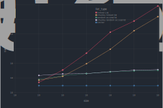

````julia
using PureFun,
      PureFun.Linked, PureFun.RandomAccess,
      PureFun.Chunky, PureFun.Contiguous,
      PureFun.VectorCopy

using BenchmarkTools, Gadfly, DataFrames, Query, Printf

const Chunk = Contiguous.StaticChunk{8}
const w, h = 900px, 600px
set_default_plot_size(w, h)
````

# Iteration

This section attempts to evaluate relative iteration performance of a handful of
list types. We review two specific iteration patterns:

- inorder iteration (via `(map)foldl`)
- reducing a list via `(map)reduce`, which requires a commutative operation.

In practice, performance will depend on a number of application-specific
parameters (size and type of the data, the types of functions being called on
them in each iteration, etc), and it's best to create specific benchmarks.

We'll compare the standard linked list with the random access list, along with
chunky versions of each. We expect to have fewer cache misses when iterating
over contiguous data, so the chunky versions should perform well on these
benchmarks.

The `VectorCopy.List` is included as a reference point -- it is just a wrapper
around `Base.Vector` so we expect it to be very fast on iteration benchmarks

````julia
Chunky.@list(ChunkyLL, list = Linked.List, chunk = Chunk)
Chunky.@list(ChunkyRAL, list = RandomAccess.List, chunk = Chunk)

lists = Dict(
    Linked.List       => "linked List",
    ChunkyLL          => "chunky linked list",
    RandomAccess.List => "random access list",
    ChunkyRAL         => "chunky random access list",
    VectorCopy.List   => "vector"
   );
````

These types of benchmarks are sensitive to the types of functions applied in
each iteration. Here we use pretty fast operations, to highlight the relative
times each container requires to access elements.

````julia
function time_iter(LT, sizes = 10 .^ (1:6))
    ListType, label = LT
    folds = Vector{Float64}(undef, length(sizes))
    reduces = Vector{Float64}(undef, length(sizes))
    for ix in eachindex(sizes)
        xs = ListType(rand(Int, sizes[ix]))
        folds[ix] = @belapsed mapfoldl(x -> x^2, +, $xs) evals=10 samples=100
        reduces[ix] = @belapsed mapreduce(x -> x^2, +, $xs) evals=10 samples=100
    end
    DataFrame(list_type = label, size = sizes, fold = folds, reduce = reduces)
end

function time_pushfirst(LT, sizes = 2 .^ (3:10))
    ListType, label = LT
    function f(sz)
        xs = ListType(rand(Int, sz))
        nu = rand(Int)
        @belapsed pushfirst($xs, $nu)
    end
    DataFrame(list_type = label, size = sizes, time = map(f, sizes))
end

iter_results = mapreduce(time_iter, vcat, lists)
pushfirst_results = mapreduce(time_pushfirst, vcat, lists)

foldreduce = stack(iter_results, [:fold, :reduce]) |>
    @rename(:variable => :operation, :value => :time) |>
    DataFrame

Gadfly.with_theme(:dark) do
plot(foldreduce,
     x = :size, y = :time, color = :list_type, xgroup = :operation,
     Geom.subplot_grid(Geom.point, Geom.line),
     Scale.x_log10, Scale.y_log10,
     Guide.colorkey(pos = [.5w, -.3h]))
end
````


Due to the tree-based underlying representation, list types based on
`RandomAccess.List`s are able to better optimize reductions, when compared to
performance on folds:

````julia
iter_results |>
    @filter(_.size == 1_000_000) |>
    @mutate(fold_μs = _.fold * 1_000_000, reduce_μs = _.reduce * 1_000_000) |>
    @select(:list_type, :size, :fold_μs, :reduce_μs)
````

````
5x4 query result
list_type                 │ size    │ fold_μs │ reduce_μs
──────────────────────────┼─────────┼─────────┼──────────
linked List               │ 1000000 │ 1913.98 │ 1917.94  
chunky linked list        │ 1000000 │ 689.325 │ 422.196  
random access list        │ 1000000 │ 6902.66 │ 1429.47  
chunky random access list │ 1000000 │ 1359.59 │ 509.65   
vector                    │ 1000000 │ 317.729 │ 250.317  
````

All of the non-vector types require constant time for `pushfirst`:

````julia
Gadfly.with_theme(:dark) do
plot(pushfirst_results,
     x = :size, y = :time, color = :list_type,
     Geom.point, Geom.line,
     Scale.x_log2, Scale.y_log10,
     Guide.colorkey(pos = [.5w, -.3h]))
end
````


# Indexing

Here we compare times to look up random indexes in a list. For normal linked
lists, this is an $\mathcal{O}(n)$ operation, while for vectors an index
requires just a single memory access, regardless of collection size. The random
access lists are not constant-time, but they are logarithmic so index time
grows much more slowly

````julia
function time_index(LT, sizes = 10 .^ (1:6))
    ListType, label = LT
    function f(sz)
        xs = ListType(rand(Int, sz))
        res = @benchmark $xs[i] setup=i=rand(1:$sz)
        round(Int, median(res).time)
    end
    DataFrame(list_type = label, size = sizes, time = map(f, sizes))
end

index_results = mapreduce(time_index, vcat, lists)

Gadfly.with_theme(:dark) do
plot(index_results,
     x = :size, y = :time, color = :list_type,
     Geom.point, Geom.line,
     Scale.x_log10, Scale.y_log10,
     Guide.colorkey(pos = [.5w, -.3h]))
end
````


---

*This page was generated using [Literate.jl](https://github.com/fredrikekre/Literate.jl).*

